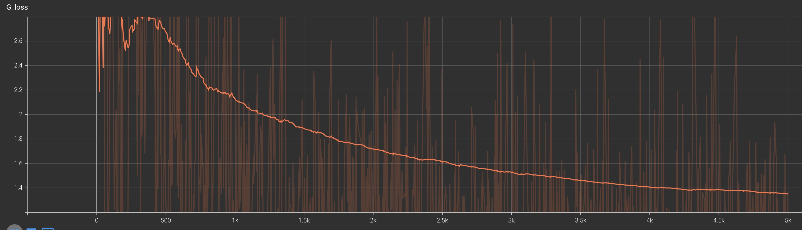
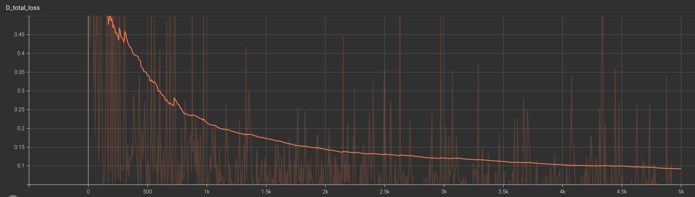
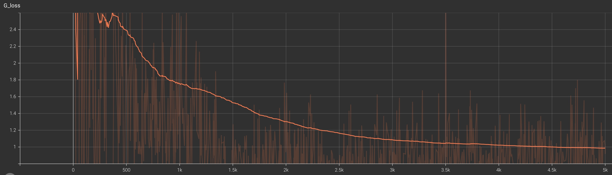
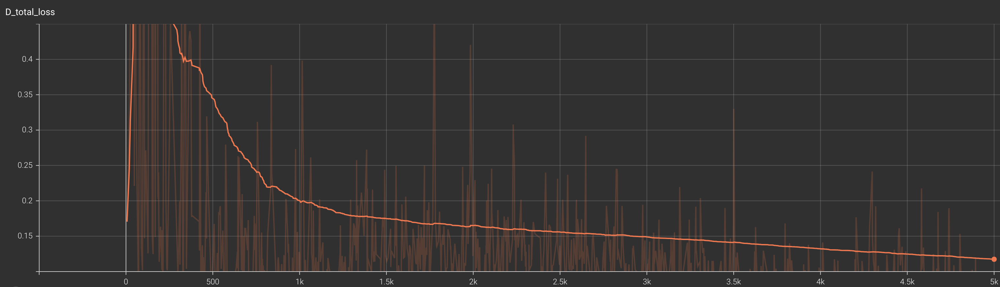
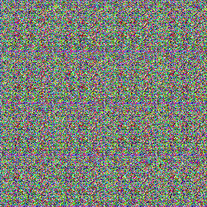

## Problem3

1. Padding. In each of the convolutional layers shown above, we downsample the spatial dimension
of the input volume by a factor of 2. Given that we use kernel size K = 4 and stride S = 2, what
should the padding be? Write your answer on your website, and show your work (e.g., the formula you used to derive the padding).

- **Answer:**
    To calculate the padding needed, we can use the formula:

    $$Output\_size = \frac{Input\_size + 2 \times Padding - Kernel\_size}{Stride} + 1$$

    Given:

        Kernel size K = 4
        Stride S = 2
        Downsampling factor = 2
    meaning the output spatial dimension should be half of the input spatial dimension
    We want `Output_size = Input_size / 2` for each convolutional layer to achieve the desired downsampling.

    Substituting this into the formula:
    
    $$
    \begin{aligned}
    \frac{Input\_size}{2} & = \frac{(Input\_size + 2 \times Padding - 4)}{2} + 1 \\
    Input\_size & = Input\_size + 2 \times Padding - 4 + 2 \\
    Padding & = 1
    \end{aligned}
    $$
    Thus, the padding should be 1, the code below demonstrates this:
    ```python
    self.conv1 = conv(in_channels=3,           
                out_channels=conv_dim, 
                kernel_size=4, stride=2, padding=1, norm='instance')
      # 32*32*32
    self.conv2 = conv(in_channels=conv_dim,
                out_channels=conv_dim*2, 
                kernel_size=4, stride=2, padding=1, norm='instance')
      # 64*16*16
    self.conv3 = conv(in_channels=conv_dim*2,  
                out_channels=conv_dim*4, 
                kernel_size=4, stride=2, padding=1, norm='instance')
      # 128*8*8
    self.conv4 = conv(in_channels=conv_dim*4,  
                out_channels=conv_dim*8, 
                kernel_size=4, stride=2, padding=1, norm='instance')
      # 256*4*4
    self.conv5 = conv(in_channels=conv_dim*8,  
                out_channels=1, 
                kernel_size=4, stride=1, padding=0, norm=None)
      # 1*1*1
    ```
2. Screenshots of discriminator and generator training loss with both data aug=basic/deluxe – 4
curves in total. Briefly explain what the curves should look like if GAN manages to train.

- **Answer:**
  data aug=basic:
  
  
  data aug=deluxe:
  
  
  If the GAN(generative adversarial network) is successfully trained, the discriminator and generator training loss curves should ideally show a downward trend and eventually converge to a lower stable value. Successful GAN training causes the discriminator and generator loss to converge and stabilize at low values, suggesting that the generator can generate real samples that are so similar to the real data distribution that it is difficult for the discriminator to distinguish. The curves in the above images seem to show desired downward trend, which indicates that GAN training is progressing well at the given basic and deluxe data enhancement Settings.

3. Set data augmentation to deluxe and then show one of the samples from early in training (e.g.,
iteration 200) and one of the samples from later in training, and give the iteration number for those
samples. Briefly comment on the quality of the samples, and in what way they improve through
training. (It typically requires more than 3,000 iterations to attain a visually appealing effect.
Pictures in the early stages of training will be blurry.)
- **Answer:**
  |   early(iteration 200)     |  later(iteration 5000)   |
  |:--------------------------:|:------------------------:|
  |  |  |

  Initial samples exhibit blurriness and a dearth of detail, whereas subsequent ones emerge with enhanced clarity and richness.  This progression occurs as the generator progressively masters the creation of more lifelike images throughout its training, paralleled by the discriminator's refined ability to discern genuine images from fabricated ones.  The iterative enhancement of both components — the generator and the discriminator — in their specialized roles leads to a marked improvement in the fidelity of generated imagery.


4. Discussion.
- DCGAN is more stable than traditional GAN in training, but there are still certain problems. What
problems did you find during this training?
  - **Answer:**
    - Slow loss convergence - Although the curve shows a downward trend, it converges more slowly in the later stages, which can cause the model to take too long to train.

    - Oscillation phenomenon - There is a certain oscillation in the curve, although the amplitude is not large, but it reflects the instability in the training process.

    - Pattern collapse - Some curves rebound slightly later, possibly due to a mode collapse, where the generator only learns to generate a limited variety of samples.

    - Vanishing Gradient - This impedes learning by causing the gradient to vanish, leading to sluggish or stagnant progress.
- How do you think it should be improved? Do other generative models (VAE, Diffusion) also have
such problems?
  - **Answer:**
    - Optimize training strategies - such as using different optimizers, regularization techniques, or loss functions to speed up convergence and improve stability.

    - Improve network architecture - Explore new generator and discriminator architectures to improve model representation.

    - Improve data processing - Optimize data preprocessing, enhancement, and sampling strategies to mitigate issues such as schema crashes.

    Other generative models such as VAE and diffusion models present similar training stability and pattern collapse challenges, but the specific performance and solutions may vary. VAE is often limited by fuzzy results and difficulty in extension. The diffusion model generates images by gradually eliminating Gaussian noise, which is relatively more stable, but the training cost is high and it is difficult to extend to multimodal tasks.
    