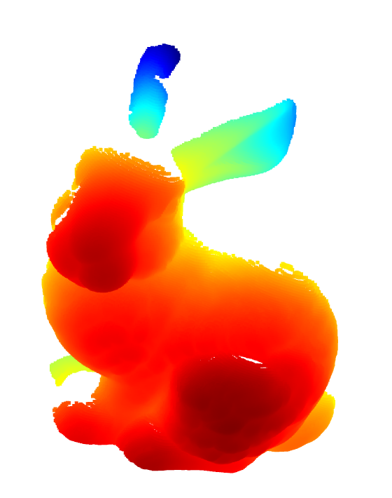
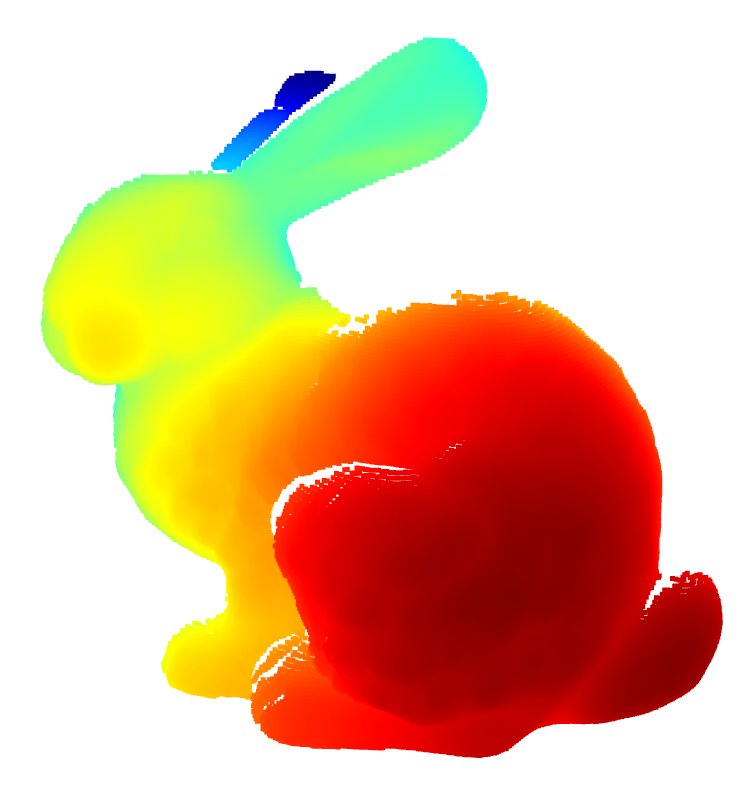
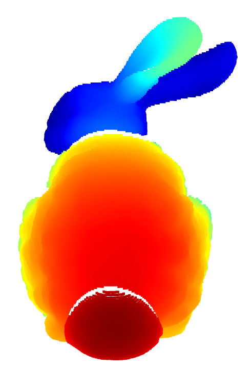
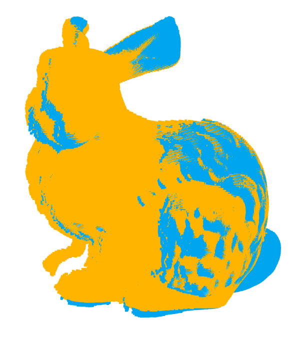
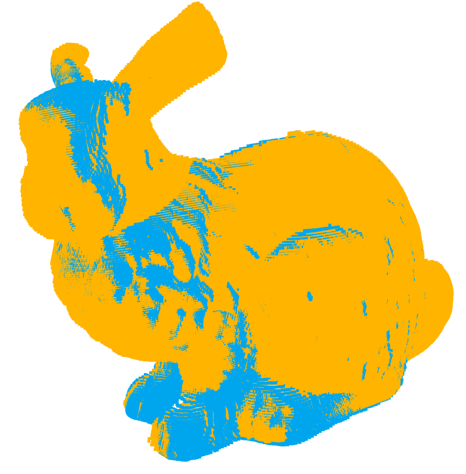
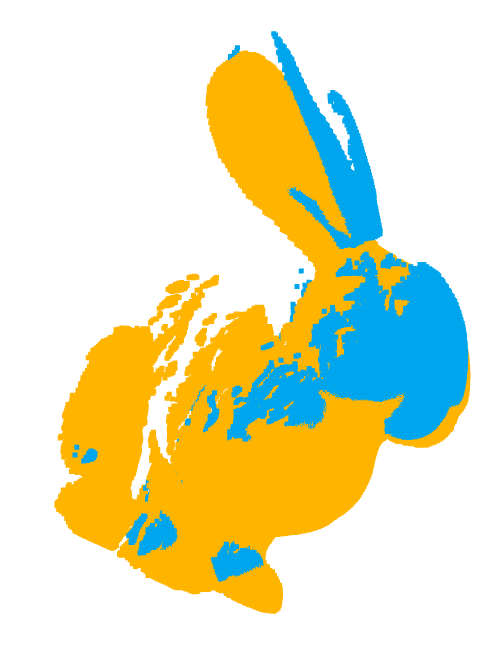
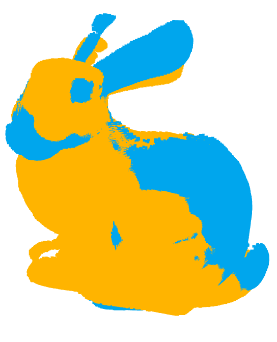
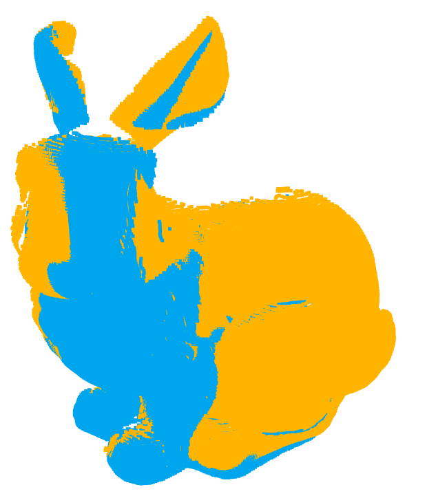

### CS172-Assignment-2

### 1. Understand Point Cloud

  

    
<strong>p1_000</strong>

    
  

  

    
<strong>p1_045</strong>

    
  

  

    
<strong>p1_090</strong>

    
  

### 2. Implement Iterative Closest Point Algorithm
My code is in the `code/p2.py` file.(The `icp.py` file is my implementation using third party )

  

    
<strong>000with045</strong>

    
  

  

    
<strong>000with315</strong>

    
  

  

    
<strong>270with315</strong>

    
  

 
 
 
 

### 3. ICP with RANSAC
My code is in the `code/p3.py` file.

  

    
<strong>000with045</strong>

    
  

  

    
<strong>000with315</strong>

    
  

  

    
<strong>270with315</strong>

    
  

